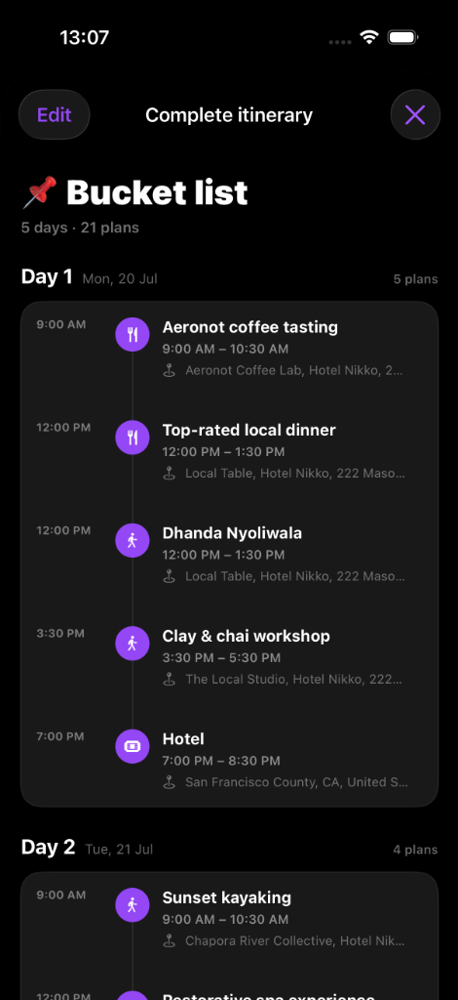
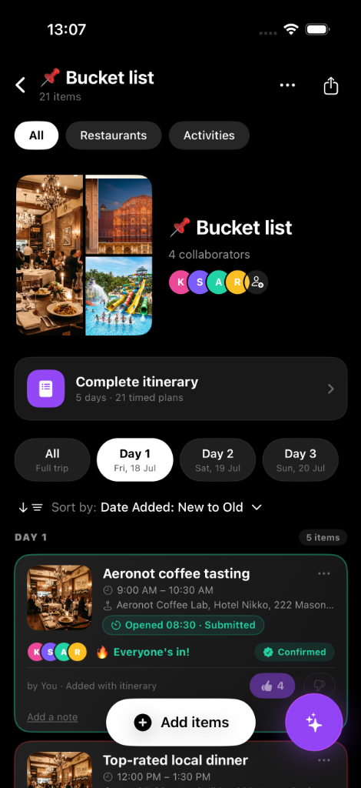
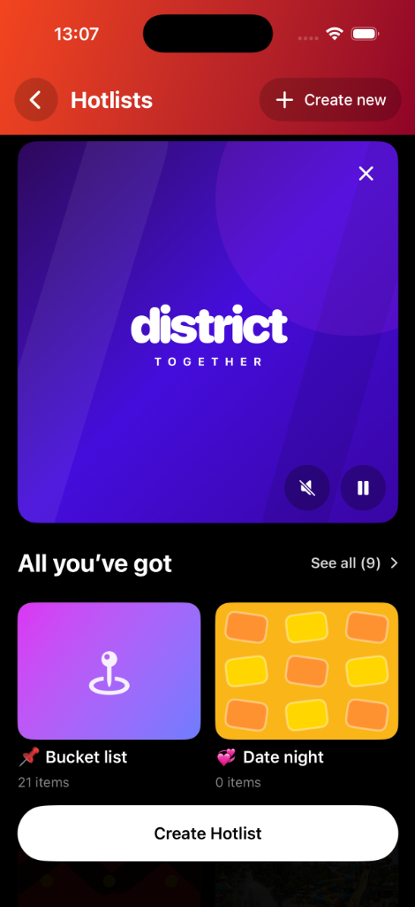

# 📍 District Together

> **Plan trips together. Decide together. Go together.**

District Together is a collaborative iOS trip-planning app that lets friend groups build shared hotlists, vote on activities, and auto-generate intelligent itineraries — all in real time.

---

## 📱 Screenshots

<p align="center">
  
  &nbsp;&nbsp;&nbsp;
  
  &nbsp;&nbsp;&nbsp;
  
</p>

<p align="center">
  <em>Hotlists Home &nbsp;·&nbsp; Collaborative Bucket List Feed &nbsp;·&nbsp; Day-wise Itinerary View</em>
</p>

---

## ✨ Features

### 🗂 Hotlists
- Create named collections (e.g. *Bucket List*, *Date Night*, *Weekend Trip*)
- Each hotlist shows live item counts and a vibrant cover artwork
- Browse all hotlists from a beautiful home screen with an animated **district together** intro banner

### 🤝 Collaborative Trip Feed
- Add restaurants, activities, and events to a shared trip feed
- Filter items by **All / Restaurants / Activities**
- Sort by **Date Added**, category, or day
- See collaborator avatars (K, S, A, R) and vote counts at a glance

### 🗳 Voting & Consensus
- Thumbs-up / thumbs-down on every trip item
- Real-time **Everyone's In!** badge when all collaborators agree
- **Confirmed** checkmark locks in the activity for the group
- Conflict detection flags scheduling clashes automatically

### 🗓 Itinerary Planner
- Auto-generates a **5-day, day-wise itinerary** from your hotlist items
- Timeline view shows time slots (e.g. 9:00 AM – 10:30 AM) with venue details
- Day-by-day navigation (Day 1, Day 2 … Day 5)
- Each entry shows category icon (🍴 dining, 🏃 activity, 🏨 hotel) in a purple pill

### 🤖 AI Assistant
- Built-in AI chat to suggest new places, resolve conflicts, or rebalance the itinerary
- Accepts natural-language queries ("find us a spa near Hotel Nikko")
- Returns rich recommendation cards with price, distance, and available slots

### 📝 Notes & Proposals
- Add personal notes to any trip item
- Propose schedule changes via the Proposal system — friends vote asynchronously
- Comments thread attached to every proposal

### ⏰ Smart Arrival Polling
- Automatically opens a **check-in poll** 30 minutes before each activity
- 15-minute poll window notifies collaborators to confirm they're on the way
- Poll state machine derived from real trip date + time slot

---

## 🏗 Architecture

```
DistrictTogether/
├── Sources/
│   ├── DistrictTogetherApp.swift       # App entry point (@main)
│   ├── ContentView.swift               # Root navigation coordinator
│   ├── Models.swift                    # Core data models & helpers
│   ├── MockData.swift                  # Sample data for preview & demo
│   ├── HotlistsHomeView.swift          # Hotlists home screen
│   ├── TripFeedView.swift              # Collaborative trip feed (main screen)
│   ├── AIAssistantView.swift           # AI chat & recommendation engine
│   ├── FoundationItineraryPlanner.swift# Day-wise itinerary generation logic
│   └── Views/
│       ├── TripItemCard.swift          # Individual trip item card component
│       ├── ItemDetailView.swift        # Full-screen item detail sheet
│       └── ProposalCard.swift          # Voting proposal card component
├── DistrictTogether.xcodeproj/         # Xcode project
├── project.yml                         # XcodeGen project spec
└── Screenshots/                        # App screenshots
```

---

## 🧩 Data Models

| Model | Description |
|-------|-------------|
| `TripItem` | A restaurant, activity or event with voting, scheduling, and conflict data |
| `YesVoter` | A collaborator who voted YES (initial, name, avatar color) |
| `Proposal` | A change proposal with votes, comments, and approval state |
| `AIRecommendation` | An AI-suggested place with price, distance, and match reason |
| `ChatMessage` | A message in the AI assistant conversation |
| `Collaborator` | A trip member (name, initial, color, role) |
| `HotlistCollection` | A named group of trip items with artwork |
| `AddSearchItem` | A search result that can be bookmarked and added |

---

## ⚙️ Requirements

| Requirement | Version |
|-------------|---------|
| iOS | 17.0+ |
| Swift | 5.9+ |
| Xcode | 15.0+ |
| macOS (build) | 14.0+ (Sonoma) |

---

## 🚀 Getting Started

### Option A — Open with Xcode (pre-generated project)

```bash
git clone https://github.com/kashishgupta748/district-together.git
cd district-together
open DistrictTogether.xcodeproj
```

Then select a simulator or connected device and press **⌘R** to run.

### Option B — Regenerate with XcodeGen

If you want to regenerate the Xcode project from the spec:

```bash
# Install XcodeGen if you haven't
brew install xcodegen

# Clone and generate
git clone https://github.com/kashishgupta748/district-together.git
cd district-together
xcodegen generate
open DistrictTogether.xcodeproj
```

---

## 🎨 Design System

- **Color Palette**: Deep black background (`#000000`) with vibrant purple (`#7c5cfc`) accents
- **Typography**: SF Pro (system default on iOS) for a native feel
- **Dark Mode**: Forced dark mode throughout for a premium aesthetic
- **Icons**: SF Symbols for all UI icons
- **Collaborator Avatars**: Color-coded initials — Pink (K), Purple (S), Teal (A), Amber (R)

---

## 🗺 App Flow

```
HotlistsHomeView
    │
    ▼  (select or create hotlist)
TripFeedView
    │
    ├──▶  ItemDetailView        (tap a trip item)
    ├──▶  ProposalCard          (group voting sheet)
    ├──▶  AIAssistantView       (AI chat sheet)
    └──▶  FoundationItineraryPlanner → Complete Itinerary view
```

---

## 📦 Bundle ID

```
com.district.together
```

---

## 👥 Developers 

  Kashish Gupta
  Amit Sharma
  Saurabh Mishra

---

## 📄 License

This project is for demonstration and portfolio purposes.

---

<p align="center">
  Made with ❤️ using SwiftUI &nbsp;·&nbsp; <strong>District Together</strong>
</p>
